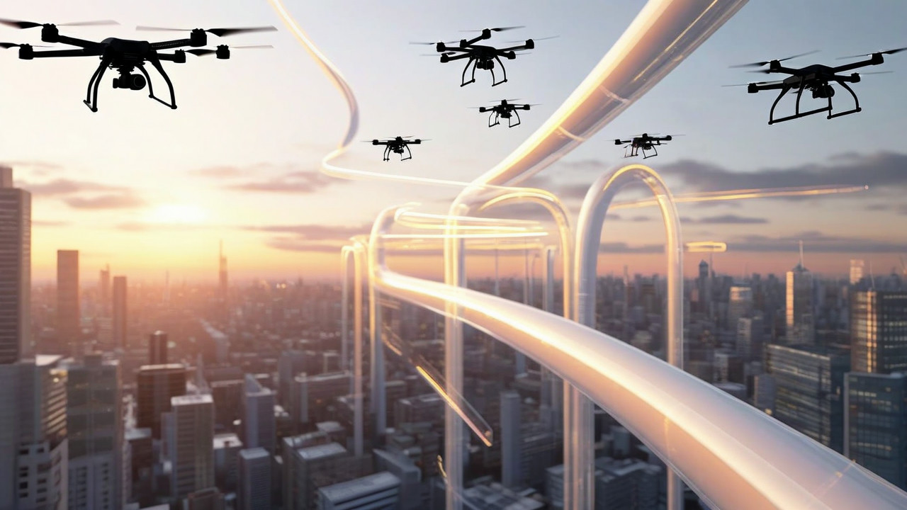

# Multi-agent Simulation for Air Corridors

The rapid growth of unmanned air vehicles (UAVs) in applications such as delivery services, surveillance, and disaster response necessitate efficient and safe navigation strategies in three-dimensional space.

Inspired by the concept of self-organized trail formation in pedestrian dynamics, this project aims to develop a computer simulation for self-organized air corridor generation in arbitrary dimensions.

Building on the social force model the simulation will model UAVs as agents influenced by social forces to form trails that optimize efficiency and safety.

The goal is to create adaptive air corridors that account for environmental factors, geographical constraints, and UAV-specific behaviors.

